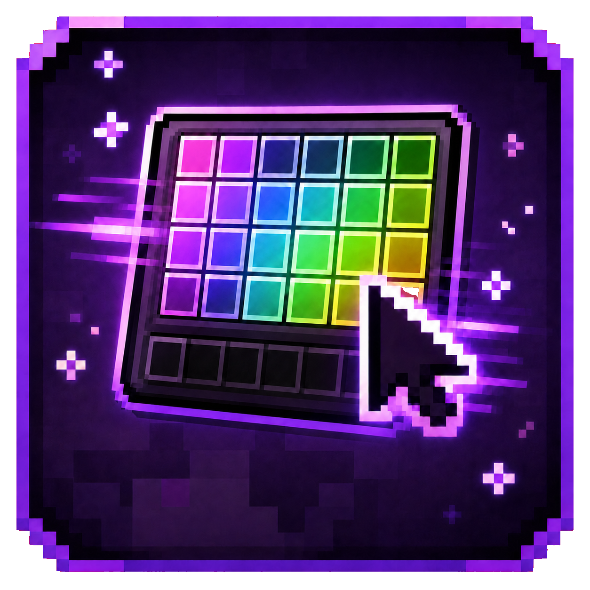

<p align="center">
  
</p>

<h1 align="center">KoHs Inventory Tweaks</h1>

<p align="center">
  <strong>El sucesor de KoHs Inv Cursor, reconstruido para Minecraft Java 26.1.2.</strong>
</p>

<p align="center">
  <a href="https://github.com/kerlycanelita/KoHs-Inventory-Tweaks"></a>
  <a href="https://github.com/kerlycanelita/KoHs-Inventory-Tweaks/issues"></a>
  <a href="https://discord.gg/9t2VxEF7UU"></a>
  <a href="WIKI.md"></a>
</p>

KoHs Inventory Tweaks es un mod exclusivamente de cliente para Fabric. Interviene en la preparación y el renderizado de las pantallas de inventario sin reemplazar la lógica de inventario del servidor. Su objetivo es ofrecer una apertura consistente, controles visuales configurables y una interfaz responsiva que conserve las interacciones Vanilla.

Este repositorio contiene únicamente la implementación para **Minecraft 26.1.2**. Las versiones anteriores de KoHs Inv Cursor no forman parte de este proyecto.

## Compatibilidad

| Componente | Versión |
|---|---:|
| Minecraft Java Edition | **26.1.2** |
| Fabric Loader | **0.19.3 o superior** |
| Fabric API | **0.155.2+26.1.2** |
| Java | **25 o superior** |
| Mod Menu | Opcional, recomendado |

No es necesario instalar el mod en el servidor.

## Funciones técnicas

- **Cursor Landing:** guarda coordenadas normalizadas independientes para inventario, cofre simple, cofre doble, Ender Chest y barril. Los contenedores pueden volver individualmente al comportamiento Vanilla.
- **Center Mouse Fix:** realiza una verificación corta al abrir el inventario del jugador para corregir eventos inesperados de centrado, sin afectar otros contenedores, arrastrar ni forzar continuamente el cursor.
- **SuperFastInventory:** abre el inventario inmediatamente y conserva una pulsación casi simultánea de la tecla de offhand. El intercambio se ejecuta sobre el slot Vanilla bajo el cursor una vez que la pantalla está preparada.
- **Customization:** compone en tiempo de ejecución la textura del inventario y de contenedores compatibles, con paletas RGB, opacidad, fondos estáticos o animados y soporte para resource packs.
- **GUI Scaler:** escala únicamente el inventario del jugador, incluidos slots, objetos, texto y modelo del personaje, entre 65 % y 175 % con límites adaptativos según la ventana.
- **Item Highlighter:** configura colores por objeto, resaltado opcional en hotbar y activación dinámica basada en el `hoveredSlot` calculado por Minecraft.
- **Persistencia segura:** cada cambio se sanea y se escribe mediante reemplazo atómico en `config/kohs_inventory_tweaks.json`.

## Instalación

1. Instala Fabric Loader para Minecraft 26.1.2.
2. Instala Fabric API.
3. Copia el JAR de KoHs Inventory Tweaks en la carpeta `mods` de la instancia.
4. Instala Mod Menu si deseas abrir la configuración desde su lista de mods.
5. Entra a un mundo o servidor antes de abrir la configuración; las previews necesitan un jugador y recursos activos.

Consulta la [Wiki completa](WIKI.md) para aprender a configurar colores, fondos, cursor, escala e Item Highlighter.

## Compilación

```powershell
$env:JAVA_HOME = "C:\Program Files\Java\jdk-25.0.2"
.\gradlew.bat clean build
```

El JAR generado aparece en `build/libs/`.

## Soporte

- Errores reproducibles: [GitHub Issues](https://github.com/kerlycanelita/KoHs-Inventory-Tweaks/issues)
- Comunidad y ayuda: [Discord](https://discord.gg/9t2VxEF7UU)

## Licencia

Distribuido bajo la licencia [MIT](LICENSE). Copyright © 2026 zymekoh.
