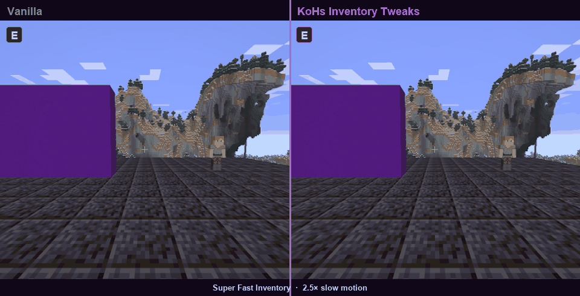
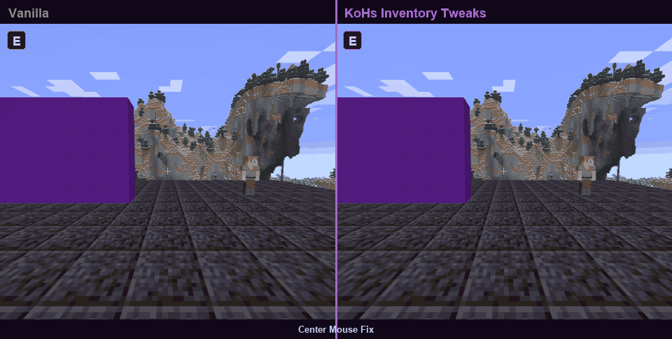
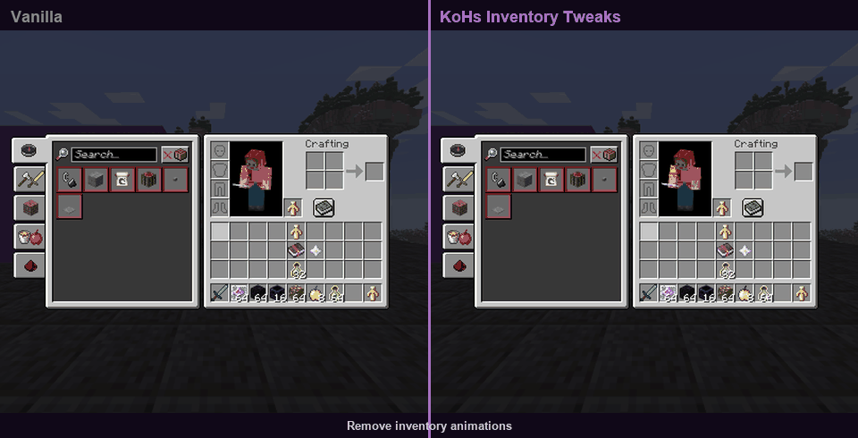

# KoHs Inventory Tweaks

[](https://github.com/kerlycanelita/KoHs-Inventory-Tweaks)
[](https://modrinth.com/mod/kohs-inv-cursor)
[](https://github.com/kerlycanelita/KoHs-Inventory-Tweaks/issues)
[](https://discord.gg/9t2VxEF7UU)

<p align="center">
  
</p>

**Deterministic cursor placement, inventory customization, and guarded rapid input.**

KoHs Inventory Tweaks is a Fabric client-side mod that hooks into inventory-screen preparation and rendering without replacing server inventory logic. It provides deterministic cursor placement, guarded rapid input, configurable visuals, and a responsive interface while preserving vanilla interactions.

This repository contains released implementations for **Minecraft 26.2, 26.1.2, 26.1.1, 26.1, and 1.21.11**. The Minecraft 26.1.2 implementation is the repository root; every additional target lives in its own directory under `versions/`.

## See the difference

Each recording plays the same input twice: Vanilla on the left, KoHs Inventory Tweaks on the right. The same clips play in the game when you hover the option.

**Super Fast Inventory**: the inventory is on screen before the next client tick. Shown at 2.5× slow motion.



**Center Mouse Fix**: after a window resize, GLFW puts the pointer back at a stale spot. KoHs corrects it once, when the mouse is released, and the hand then moves to the totem without any pull.



**Reduce inventory visual motion**: the enchanting book and the item return motion hold still. Glint and progress stay Vanilla's.



## Supported versions

Since 26 September 2026, KoHs Inventory Tweaks supports **Minecraft 1.21.11 and later**. Minecraft 1.21.10 is no longer maintained: its builds (the last one is `1.0.8+mc1.21.10`) stay downloadable on Modrinth as archived versions, but they will not receive fixes or new features. The 1.21.10 source tree and the unreleased 1.21–1.21.9 work moved to [`archive/`](archive/README.md).

## Compatibility

| Minecraft | Fabric API | Java | Source |
|---|---|---:|---|
| **26.2** | **0.157.0+26.2** | **25+** | `versions/kohs-inventory-tweaks-26.2` |
| **26.1.2** | **0.155.2+26.1.2** | **25+** | Repository root |
| **26.1.1** | **0.145.4+26.1.1** | **25+** | `versions/kohs-inventory-tweaks-26.1.1` |
| **26.1** | **0.145.1+26.1** | **25+** | `versions/kohs-inventory-tweaks-26.1` |
| **1.21.11** | **0.141.6+1.21.11** | **21+** | `versions/kohs-inventory-tweaks-1.21.11` |

All builds require Fabric Loader 0.19.3 or newer. Mod Menu is optional and recommended.

The mod does not need to be installed on the server.

## What it changes

- **Cursor Landing:** stores independent normalized coordinates for the player inventory, single chest, double chest, Shulker Box, Ender Chest, and barrel. Individual container types can fall back to vanilla cursor behavior.
- **Center Mouse Fix:** checks the pointer once, right after Minecraft releases the mouse, and corrects it only when GLFW restored a stale position. Movement made while the inventory opens, such as reaching for a totem, is never pulled back.
- **Super Fast Inventory:** optionally constructs the ordinary local inventory screen directly from the physical keyboard or remapped mouse press, up to one client tick (50 ms) sooner. It waits for the tick only when Vanilla would still run something first: a hotbar key, a pending attack or use, an item in use, or a block being broken. Server-controlled openings, slot actions, packet types, cooldowns, and validation stay on Vanilla paths.
- **Reduce inventory visual motion:** stills recipe-button bounce, item return motion, the enchanting book and animated backgrounds, while progress indicators and enchanted-item glint stay Vanilla's.
- **Customization:** composes player-inventory and compatible-container textures at runtime using RGB palettes, opacity controls, static or animated backgrounds, and resource-pack-aware sources.
- **GUI Scaler:** scales the player inventory—including slots, items, text, and the player model—from 65% to 315%, starting at 200% on a fresh installation and using adaptive limits based on available space. The default-enabled Affect Containers switch applies that scale to supported chest, Shulker Box, barrel, and Ender Chest screens.
- **Item Highlighter:** stores per-item colors, optional HUD hotbar highlighting, and dynamic activation based on Minecraft's calculated hovered slot.
- **Player Visibility:** can tint normally visible players and draw a glowing silhouette around them while your inventory is open, outside its panel. Both are depth-tested like the body, so blocks hide them and nothing shows through walls; Minecraft's glowing outline is never used. Its page shows a live world view beside a walking preview of your own skin and equipment.
- **Settings page:** each option shows only its name; hovering it explains the option and, for the three options above, plays the recorded comparison.
- **Safe persistence:** sanitizes every setting and writes it through atomic replacement to config/kohs_inventory_tweaks.json.

## Install

1. Install Fabric Loader for your supported Minecraft version.
2. Install the matching Fabric API release.
3. Place the matching KoHs Inventory Tweaks JAR in the instance's mods directory.
4. Optionally install Mod Menu to access configuration through the mod list.
5. Join a world or server before opening the configuration menu; previews require an active player and loaded resources.

Read the [English wiki](docs/wiki/WIKI.md) for complete instructions covering colors, backgrounds, cursor placement, GUI scaling, and Item Highlighter. A Spanish edition is available through the language button at the top of the wiki.

## Building

With JDK 25 available through `JAVA_HOME`:

```powershell
.\gradlew.bat build --no-daemon
```

The 26.1.2 JAR is written to `build/libs/`. To build another supported target, use the JDK declared by that target and run the same command from its `versions/kohs-inventory-tweaks-<minecraft-version>` directory; each JAR is written to that directory's `build/libs/`.

Changes are made in the repository root (Minecraft 26.1.2). The other targets are rebuilt from it, with their own API differences applied:

    python tools/port/port_version.py all

## Verification

    python tools/verify-all-versions.py

Add `--minecraft-version <version>` to check a range target against any version of its range rather than its default; pointing `--source-root` at an overlay target follows it to the sources it compiles.

This checks every source tree against the exact Minecraft jar it compiles against and reports any `@Mixin` target class, injected method, accessor, invoker, or `INVOKE` injection point that no longer exists there. It is the pre-launch check for the failure mode that produces a startup crash after a Minecraft update. Pass `--source-root <directory>` to `tools/verify-mixin-targets.py` to check a single tree.

    python tools/verify-translations.py

This reports any translation key the client asks for that is missing from a language file, and any key present in English but absent from a translation.

    python tools/verify-release-artifacts.py --release 1.0.13

After building all five targets, this checks each release JAR's metadata, mixin classes, Java target and bundled translations, and prints its size and hashes.

[`docs/PERFORMANCE.md`](docs/PERFORMANCE.md) documents which hooks run in the frame loop and what they are allowed to do.

## Support

- Reproducible bugs: [GitHub Issues](https://github.com/kerlycanelita/KoHs-Inventory-Tweaks/issues)
- Community and help: [Discord](https://discord.gg/9t2VxEF7UU)

## Repository layout

| Location | Contents |
| --- | --- |
| `src/` | The main Minecraft 26.1.2 implementation. |
| `versions/` | Separate source targets; legacy local artifacts stay excluded. |
| `archive/` | Retired targets (Minecraft 1.21.10 and earlier), kept unchanged. |
| `debug/` | Optional diagnostic companions, separate from the playable mod. |
| `docs/` | English/Spanish wiki, player reports, audits and release notes. |
| `tools/` | Mixin, translation, artifact and cursor-contract checks. |

Start with the [documentation index](docs/README.md). Build output and local
Minecraft instances remain outside Git; keep installable JARs out of the source tree.

## License

Distributed under the [MIT License](LICENSE). Copyright © 2026 zymekoh.

## Credits

Made by **zymekoh**.
